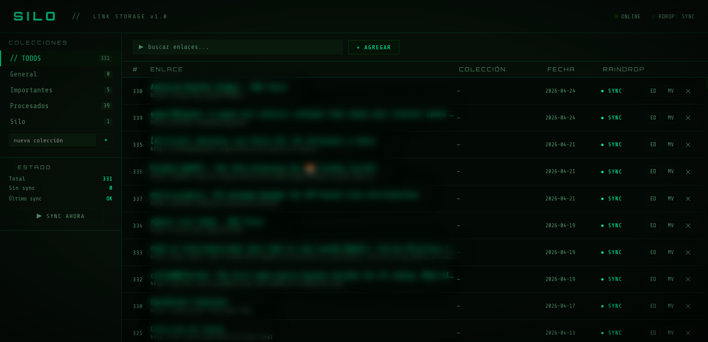
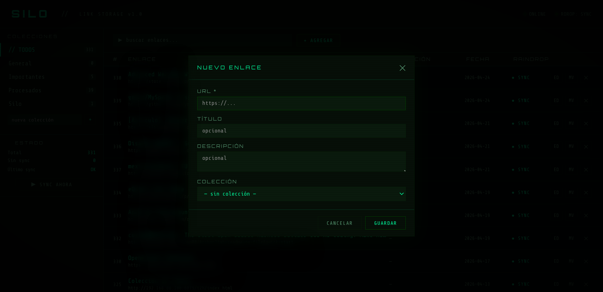
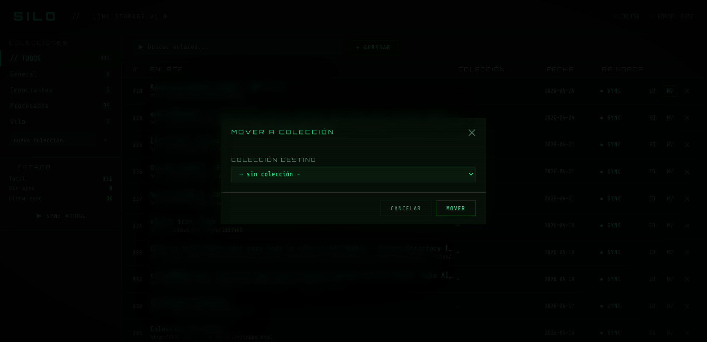

# Silo

Servicio de guardado de enlaces, autoalojado. API REST con dashboard web, sincronización con Raindrop y notificaciones via Gotify.

## Características

- Almacenamiento de enlaces con título, descripción y colecciones
- Dashboard web estilo terminal (puerto 7123)
- API REST con autenticación Bearer token
- Sincronización unidireccional con Raindrop (inmediata + cron de respaldo)
- Obtención automática del título de la página al agregar un enlace
- Notificaciones via Gotify al sincronizar
- Base de datos SQLite

## Capturas





## Stack

- Python 3.12 / FastAPI
- aiosqlite (async)
- aiohttp
- Docker

## Estructura

```
silo/
├── Dockerfile
├── docker-compose.yml
├── requirements.txt
├── templates/
│   └── dashboard.html
├── static/
└── app/
    ├── __init__.py
    ├── main.py
    ├── database.py
    ├── models.py
    ├── sync.py
    └── routers/
        ├── __init__.py
        ├── auth.py
        ├── collections.py
        ├── dashboard.py
        └── links.py
```

## Instalación

```bash
git clone https://codeberg.org/osdaeg/silo
cd silo
cp docker-compose.example.yml docker-compose.yml
```

Editá `docker-compose.yml` con tus valores y levantá el servicio:

```bash
docker-compose up -d --build
```

El dashboard queda disponible en `http://<host>:7123/dashboard`.

## Configuración

| Variable | Descripción | Default |
|---|---|---|
| `SILO_API_TOKEN` | Bearer token para la API | — |
| `RAINDROP_TOKEN` | Personal test token de Raindrop | _(vacío = sync desactivado)_ |
| `GOTIFY_URL` | URL de Gotify | — |
| `GOTIFY_TOKEN` | Token de Gotify | _(vacío = notificaciones desactivadas)_ |
| `SYNC_INTERVAL_MINUTES` | Intervalo del cron de sync con Raindrop | `30` |
| `DB_PATH` | Ruta de la base de datos | `/data/silo.db` |
| `PUID` | User ID para permisos | `1000` |
| `PGID` | Group ID para permisos | `1000` |

El token de Raindrop se obtiene en [raindrop.io/settings/integrations](https://app.raindrop.io/settings/integrations) → _Test token_.

## API

Todos los endpoints requieren:
```
Authorization: Bearer <SILO_API_TOKEN>
```

### Colecciones

```
GET    /collections
POST   /collections        { "name": "..." }
DELETE /collections/{id}
```

### Enlaces

```
GET    /links              ?collection_id=&q=
POST   /links              { "url", "title"?, "description"?, "collection_id"? }
PATCH  /links/{id}         { "title"?, "description"?, "collection_id"? }
DELETE /links/{id}
GET    /links/fetch-title  ?url=
```

### Sync

```
POST   /sync               Fuerza sync de todos los enlaces pendientes con Raindrop
```

### Dashboard

```
GET    /dashboard          Interfaz web (no requiere token en el header)
```

## Sync con Raindrop

La sincronización es **unidireccional**: Silo → Raindrop. Silo es la fuente de verdad.

- Al agregar un enlace: sync inmediata en background.
- Cron cada `SYNC_INTERVAL_MINUTES` minutos: reintenta todos los pendientes.
- Notificación Gotify al finalizar con cantidad y resultado.
- Los enlaces ya existentes en Raindrop no se duplican.

Los enlaces se guardan en una colección llamada **Silo** en Raindrop (se crea automáticamente si no existe).

## Clientes

Silo cuenta con los siguientes clientes adicionales (repositorios separados):

- **silo-cli** — [cliente de línea de comandos (bash)](https://codeberg.org/osdaeg/silo-cli)
- **silo-tui** — [cliente TUI (Python / Textual)](https://codeberg.org/osdaeg/silo-tui)
- **silo-firefox** — [extensión para Mozilla Firefox](https://codeberg.org/osdaeg/silo-firefox-extension)
- **silo-plasmoid** — [widget para KDE Plasma 6](https://codeberg.org/osdaeg/silo-plasmoid)
- **silo-android** — [app Android (offline-first, integración al menú compartir)](https://codeberg.org/osdaeg/silo-android)
